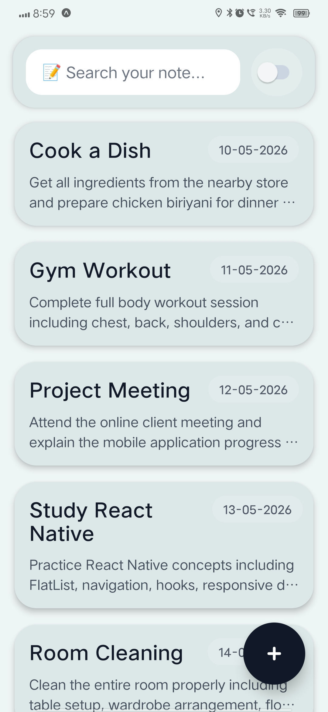

# Notes App - React Native with Expo 📝

A clean and modern Notes App UI built with React Native and Expo featuring dark/light theme support and responsive design.

## Project Overview

This is a fully functional Notes App UI demonstrating best practices in React Native development with clean architecture, responsive layouts, and polished UI/UX design.

## Components & Hooks Used

### Core React Native Components

- **SafeAreaView** - Ensures content displays safely within device safe areas
- **FlatList** - Renders scrollable list of notes with optimized performance
- **TextInput** - Search bar for filtering notes with custom styling
- **Pressable** - Touch-responsive wrapper for note cards and buttons
- **Switch** - Toggle for dark/light mode switching with enhanced styling
- **Text** - Typography for titles, content, and metadata
- **View** - Container layouts for organizing UI structure
- **StatusBar** - Dynamic status bar that adapts to theme
- **KeyboardAvoidingView** - Prevents keyboard overlap on input fields (prepared for View 2)
- **Image** - Displays icons and visual assets
- **Alert** - Shows note details on card press

### Hooks Used

- **useState** - Manages dark mode state and component state management
- **useColorScheme** - Automatic detection of device theme preference (ready for implementation)
- **useWindowDimensions** - Handles responsive layouts across different screen sizes (ready for implementation)

### External Libraries

- **react-native-safe-area-context** - Safe area padding management

## UI Components Structure

```
HomeScreen
├── SafeAreaView (Theme-aware background)
├── StatusBar (Dynamic styling based on theme)
├── View (Navigation Bar)
│   ├── TextInput (Search bar with emoji)
│   └── View (Switch Container)
│       └── Switch (Dark/Light mode toggle)
├── FlatList (Notes List)
│   └── Pressable (Note Card)
│       ├── View (Header Row)
│       │   ├── Text (Note Title)
│       │   └── Text (Date)
│       └── Text (Note Preview)
└── Pressable (FAB - Floating Action Button)
    └── Image (Plus Icon)
```

## UI/UX Enhancements & Improvements

### 🎨 Theme System

- **Dual Theme Support**: Seamless dark and light mode with carefully chosen color palettes
- **Dynamic StatusBar**: Status bar color and icon style adapt to current theme
- **Smooth Color Transitions**: All elements support theme-aware colors with consistent palette

### ✨ Enhanced Switch Component

- **Beautiful Track Colors**: Blue (#6B7280) when active, slate gray (#CBD5E1) when inactive
- **Premium Thumb Styling**: White thumb in dark mode, light gray in light mode
- **Scaled Size**: 1.2x larger for better touch targets and visibility
- **Visual Container**: Semi-transparent rounded background for depth and focus
- **iOS Optimization**: Specific background color for iOS platform consistency

### 📱 Search Bar Enhancements

- **Emoji Icon**: Added 📝 emoji prefix for visual appeal
- **Theme-Aware Colors**: Input adapts to both dark and light modes
- **High Contrast**: Placeholder text color automatically adjusts for readability
- **Refined Styling**: Rounded corners with proper padding and typography

### 🃏 Note Cards Design

- **Elevated Visual Hierarchy**: Card-based layout with rounded corners and padding
- **Flexible Content**: Title with date on same row (responsive layout)
- **Preview Text**: Shows 2-line note content snippet with ellipsis
- **Theme-Aware Backgrounds**: Different background colors for dark mode (red accent) vs light mode
- **Touch Feedback**: Pressable wrapper provides interaction feedback
- **Proper Spacing**: ItemSeparator adds breathing room between cards

### 🎯 Navigation Bar

- **Integrated Search & Toggle**: Compact header design combining search and theme toggle
- **Rounded Corners**: Modern appearance with border radius
- **Responsive Width**: Uses 93% width for balanced margins
- **Theme Support**: Background adapts to theme selection

### 🚀 FAB (Floating Action Button)

- **Fixed Positioning**: Always accessible with optimal bottom-right placement
- **Icon Theming**: Plus icon color changes based on theme
- **Proper Dimensions**: 65x65 with icon scaling for visual balance
- **Touch-Friendly**: Adequate size for easy interaction

### 🎨 Typography & Spacing

- **Consistent Font Weights**: Bold titles (fontWeight: 800) vs regular content
- **Readable Font Sizes**: Optimized sizes for different content types
- **Strategic Margins**: Proper padding and margins throughout for visual breathing room
- **Color Contrast**: High contrast text ensures readability in both themes

### 📐 Responsive Design

- **Flexible Layouts**: Uses flexDirection and percentage-based widths
- **Adaptive Styling**: Components respond to theme changes dynamically
- **Safe Area Handling**: Respects device notches and safe areas
- **Platform Awareness**: KeyboardAvoidingView support for keyboard management

## Styling Approach

All styles are created using `StyleSheet.create()` with:

- Reusable style objects
- Theme-aware dynamic styling
- Organized and maintainable style definitions
- Platform-specific considerations

## File Structure

```
src/
├── app/
│   ├── index.tsx (Notes Listing Screen - View 1)
│   └── _layout.tsx (Navigation setup)
```

## Get started

1. Install dependencies

   ```bash
   npm install
   ```

2. Start the app

   ```bash
   npx expo start
   ```

In the output, you'll find options to open the app in a

- [development build](https://docs.expo.dev/develop/development-builds/introduction/)
- [Android emulator](https://docs.expo.dev/workflow/android-studio-emulator/)
- [iOS simulator](https://docs.expo.dev/workflow/ios-simulator/)
- [Expo Go](https://expo.dev/go), a limited sandbox for trying out app development with Expo

## Getting Started with Development

You can start developing by editing the files inside the **app** directory. This project uses [file-based routing](https://docs.expo.dev/router/introduction).

### Other setup steps

- To set up ESLint for linting, run `npx expo lint`, or follow our guide on ["Using ESLint and Prettier"](https://docs.expo.dev/guides/using-eslint/)
- If you'd like to set up unit testing, follow our guide on ["Unit Testing with Jest"](https://docs.expo.dev/develop/unit-testing/)
- Learn more about the TypeScript setup in this template in our guide on ["Using TypeScript"](https://docs.expo.dev/guides/typescript/)

## Learn more

To learn more about developing your project with Expo, look at the following resources:

- [Expo documentation](https://docs.expo.dev/): Learn fundamentals, or go into advanced topics with our [guides](https://docs.expo.dev/guides).
- [Learn Expo tutorial](https://docs.expo.dev/tutorial/introduction/): Follow a step-by-step tutorial where you'll create a project that runs on Android, iOS, and the web.

## Join the community

Join our community of developers creating universal apps.

- [Expo on GitHub](https://github.com/expo/expo): View our open source platform and contribute.
- [Discord community](https://chat.expo.dev): Chat with Expo users and ask questions.

## App Output


